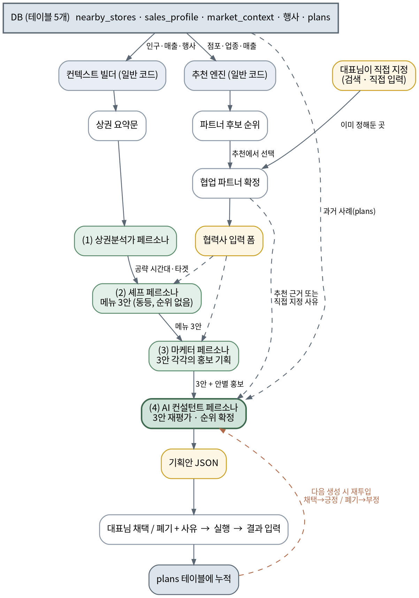

# 바틀링 'AI 프로젝트 매니저' 기획서 (v4)

**청년팀** 소복소복 (4인 — 개발 2 / 기획·콘텐츠 2) ｜ **매칭 점포** 바틀링 (서울 광진구 뚝섬로34길 67)
**사업** 서울 AI재단 소상공인 AI활용 지원사업 ｜ **작성** 2026.8.20

> **개정 이력** — v3(8/16) 이후 1차 현장방문(8/17)과 1차 멘토링(8/19) 결과를 반영했다.
> **기술 상세(프롬프트 원문·DB 스키마·화면 설계·작업 티켓)는 「개발명세서」로 분리**했다. 이 문서는 배경·범위·계획을 다룬다.

---

## 1. 프로젝트 정의

> 공공 상권 데이터로 협업 후보를 찾아주고, 그 후보와의 **콜라보 기획안 초안까지 자동으로 뽑아주는 웹 서비스.**
> 그리고 그 서비스를 **실제 협업 실행에 투입해 변화를 측정한 기록.**

### 1-1. 해결하려는 문제

바틀링 소개자료에 기재된 고민은 다음과 같다.

> *"협업하고자 하는 파트너사는 많으나, 실행까지 이어지기 위해 필요한 기획안을 내기까지 소요가 많음"*

대형 프랜차이즈는 전담 인력이 콜라보 마케팅을 기획하지만, 소상공인은 매장 운영만으로 자원이 소진되어 기획에 쓸 여력이 없다. **기획 리드타임이 병목**이다.

### 1-2. 1차 현장방문에서 확인한 사항 (8/17)

| 확인 내용 | 설계 반영 |
|---|---|
| **성수기 4·5·6·9·10월 / 비수기 12·1·2월** | 실증 구간(9/21~10/16)이 성수기와 겹쳐 유리 |
| 애로사항 — **페어링 메뉴 개발의 어려움** | AI 셰프 출력에 `페어링_추천맥주` 필드 추가 |
| 애로사항 — 매장 이용 가이드의 직관성 부족 | 이번 범위 밖 (디자인 영역) |
| [주의] **상권 데이터를 영업전략에 반영하기 어렵다는 의견** | 데이터 제시 방식을 재설계 (5장) |
| 매출·고객 데이터는 요청 시 제공 가능 | 성과 측정 설계에 반영 |
| 매장 수용 7인 내외, 테이크아웃 중심 | 조리 제약으로 프롬프트에 주입 |

---

## 2. 사업 일정과 제약

### 2-1. 주요 마일스톤

| 마일스톤 | 날짜 |
|---|---|
| 1차 점포 현장방문 | 완료 (8/17) |
| 1차 산출물 제출 | ~8/31 |
| **중간 분석보고서** | **~9/13** |
| 2차 산출물 제출 | ~9/20 |
| 3차 현장방문 (실증 구간) | 9/21~10/16 |
| **최종 산출물 제출** | **~10/18** |
| 최종평가(예선) — **비대면 서면·영상 심사** | 10/19~10/25 |
| 본선 발표회 | 10/29 |

### 2-2. 일정이 만드는 세 가지 제약

**(1) 웹은 9/20까지 동작해야 한다**
9/21~10/16이 유일한 실증 구간이다. 이 기간에 결과가 없으면 최종 분석보고서에 쓸 내용이 없다.

**(2) 실증 기간이 3.5주뿐이다**
협업 1건은 섭외 → 기획 → 준비 → 실행 → 결과 집계를 거친다. 3.5주면 현실적으로 1~2건이다.
→ **대응: 시스템 완성을 기다리지 않고 프롬프트 검증 단계에서 첫 협업을 선착수한다.**

**(3) 예선이 서면·영상 심사다**
심사위원이 웹을 직접 조작하지 않는다. UI 완성도보다 **영상에서 흐름이 보이는지**가 중요하다.
→ Streamlit으로 충분하다. UI 다듬기는 9/21 이후로 미룬다.

---

## 3. 시스템 개요



### 3-1. 파트너 선정 — 두 경로

기획안을 만들기 전에 **누구와 협업할지**를 먼저 정한다. 여기에 두 갈래를 둔다.

| 경로 | 흐름 | 언제 |
|---|---|---|
| **추천받기** | 반경 점포를 점수화 → 후보 순위 → 선택 | 협업 상대를 아직 못 정했을 때 |
| **직접 지정** | 상호 검색 또는 직접 입력 | **이미 협업할 곳을 정해두셨을 때** |

두 경로 모두 파트너가 확정되면 협력사 입력 폼으로 이어진다. 직접 지정한 경우에도 추천 점수는 함께 계산해 참고로 표시하되, 순위 결정에는 쓰지 않는다.

> **직접 지정 경로가 없으면 시스템을 우회하게 된다.** 대표님이 이미 마음에 둔 가게가 추천 목록에 없으면 아예 쓰지 않게 되므로, 두 경로를 같은 화면에 배치한다. 어느 경로로 시작했는지는 기록해두어 나중에 결과 품질을 비교한다.

### 3-2. 네 단계

바틀링 사업계획서에 명시된 페르소나 4종을 순차 체인으로 구성했다.

| 페르소나 | 역할 |
|---|---|
| **(1) AI 상권 분석가** | 대상 시점의 공략 시간대와 타겟 고객층 도출 |
| **(2) AI 셰프** | 양측 보유 자원으로 실현 가능한 콜라보 메뉴 3안 |
| **(3) 제휴 마케터** | 3안 각각의 이벤트·홍보 기획 |
| **(4) AI 컨설턴트** | 3안 재평가, 순위 확정, 정합성 교정 |

1회 생성에 **약 58초** 소요된다.

### 3-3. LLM을 쓰지 않는 두 컴포넌트

| 컴포넌트 | 역할 | 왜 코드인가 |
|---|---|---|
| **컨텍스트 빌더** | DB 수치를 LLM이 읽을 문장으로 변환 | 숫자 집계를 LLM에 맡기면 값이 부정확해질 수 있다 |
| **추천 엔진** | 협업 후보를 점수화해 순위 제시 | 계산은 코드가 정확하고 재현 가능하다 |

**LLM은 해석과 생성만 담당한다.** 수치 계산과 후보 선정은 코드가 한다.

### 3-4. 사업계획서 Step 6 '재학습'의 실현 방식

파인튜닝이 아니라 **사례 축적**이다. 사례가 5~10건 규모로 예상되어 모델 학습은 불가능하다.

```
기획안 생성 → 채택/폐기 + 사유 → 실행 → 결과 입력 → 사례 저장
                                                        ↓
                              다음 생성 시 (4)의 참고 자료로 재투입
                                채택 사례 → 좋은 예시
                                폐기 사유 → 지켜야 할 제약으로 변환
```

> 폐기 사례는 원문 그대로 넣지 않고 **"준비 기간은 3일 이내로 제한한다"** 같은 긍정형 규칙으로 바꿔 주입한다. LLM은 부정문 처리가 취약하기 때문이다.

**기술 상세는 「개발명세서」 1~4장 참조.**

---

## 4. 활용 데이터

| 데이터 | 출처 | 성격 |
|---|---|---|
| [중요] **실시간 인구·혼잡도·12시간 예측** | 서울 실시간 도시데이터 | 뚝섬한강공원·뚝섬역 2지점 |
| [중요] **실시간 상권 현황** (음식업 결제) | 서울 실시간 도시데이터 | 신한카드 제휴 |
| 추정매출 (업종×요일×시간대×연령) | 서울시 상권분석서비스 | 분기 집계 |
| 반경 1km 점포 목록 | 공공데이터포털 상가정보 | 상호·업종·좌표 |
| 문화행사 | 서울시 문화행사 API + 광진구청 게시판 | 구청 게시판은 HTML 파싱 |
| 바틀링 맥주 라인업 | 자체 (월 1회 교체) | 페어링 판단 |
| 협력사 자원 | 입력 폼 | 식재료·장비·불가조건 |

**실시간 도시데이터가 차별화 지점이다.** 기존 상권분석 서비스는 분기 집계라 "지난 분기에 이랬다"까지만 가능하지만, 실시간 데이터는 **"이번 금요일 뚝섬이 붐빌 예정이니 이때 이벤트를 걸어라"**가 가능하다.

[주의] **소상공인365 오픈 API는 사용 불가.** Iframe(화면 임베드) 형식이라 데이터 추출이 되지 않는다. 공공데이터포털의 상가정보 API가 대안이며, 이름이 유사해 혼동에 주의한다.

---

## 5. 데이터 신뢰 확보 방안

현장방문에서 *"상권 데이터를 영업전략에 반영하기 어렵다"*는 의견이 확인되었다. 우리 설계는 공공 상권데이터를 (1) 상권분석가의 주 입력으로 삼으므로, 이 간극을 좁히는 것이 프로젝트 성패와 직결된다.

| 접근 | 내용 |
|---|---|
| **행동으로 전환** | "금요일 19~22시 매출 비중이 높습니다" **(X)** → "이번 금요일 19시에 팝업을 여세요" **(O)** |
| [중요] **아는 것부터 검증받기** | 대표님이 이미 아는 사실을 먼저 제시해 신뢰를 얻고, 그다음 모르는 것을 제시 |
| **실시간 지표 우선 노출** | 분기 데이터보다 "지금 뚝섬 혼잡도"가 설득력이 크다 → 상권 대시보드를 9월 둘째 주로 앞당김 |
| **예측 대비 실제 기록** | 적중률이 쌓이면 가장 강한 근거가 된다 |

---

## 6. 범위

| 구분 | 이번 범위 | 범위 밖 |
|---|---|---|
| 사용자 | 바틀링 + 섭외 완료 협력사 | 불특정 다수 소상공인 |
| 파트너 선정 | 공공데이터 기반 **추천 + 직접 지정 병행** | 전국 단위 매칭, 제휴 성사 자동화 |
| 데이터 | 공공 API + 대표님·협력사 입력 | 리뷰·SNS 대량 크롤링 |
| 학습 | 사례 축적 | 모델 파인튜닝 |
| 장비 대여 | 자원 정보로 입력만 | 예약·정산 시스템 |

**파트너 선정에 두 경로를 둔다.** 대표님이 이미 협업할 곳을 정해둔 경우가 실제로는 더 많다. 추천 결과에서만 고르게 하면 시스템을 우회하게 되므로, 직접 지정 경로를 같은 화면에 배치한다.

---

## 7. 성과 측정

성격이 다른 두 퍼널을 구성한다.

### 퍼널 A — 협업 이벤트 성과

```
인스타 도달 → 저장·공유 → 신규 적립 → 재방문 적립
  (노출)       (관심)      (획득)      (유지)
```

매장에서 운영 중인 쿠폰 앱을 활용한다. **마지막 단계가 핵심이다** — 협업으로 온 손님이 다시 오는가. 대표님 과제가 "한강 상권 비수기 극복"이므로 일회성 화제로 끝나는지 단골이 되는지가 사업 목적과 직결된다.

> POS 원본 데이터는 요청하지 않는다. 실행일과 직전 같은 요일의 총매출 두 값이면 충분하다.

### 퍼널 B — AI PM 시스템 [중요]

```
추천 노출 → 파트너 선택 → 기획안 생성 → 채택 → 실행 → 성과 기록
```

**퍼널 B를 주 지표로 삼는다.** 데이터가 전부 시스템 내부에 있어 추가 요청이 필요 없고, **어느 단계에서 이탈하는지가 곧 개선 방향**이 된다. 생성은 많은데 채택이 없으면 기획안 품질 문제이고, 채택은 되는데 실행이 안 되면 현실성 문제다.

**최종보고서 서술 예시**

> 기획안 12건 생성 → 5건 채택(42%) → 3건 실행(60%) → 실행 3건 중 2건에서 재방문 증가 확인

[주의] 표본이 협업 1~3건이므로 **통계적 유의성은 주장하지 않는다.** 쿠폰 앱 이용률이 100%가 아니므로 절대 수치가 아닌 상대 비교로만 해석한다.

---

## 8. 실행 계획

### 8-1. 주차별

| 기간 | 내용 | 마감 |
|---|---|---|
| 8/20~8/23 | API 발급·검증, **실시간 수집기 가동**, DB 구축 | |
| 8/24~8/31 | 데이터 적재, 컨텍스트 빌더, 프롬프트 v1 | 1차 산출물 |
| 9/1~9/6 | 추천 엔진, 자동 검증, **첫 협업 수동 착수** | |
| 9/7~9/13 | 입력 폼·생성 화면, 상권 대시보드 | **중간 분석보고서** |
| 9/14~9/20 | 배포, 협력사 온보딩, 안정화 | 2차 산출물 |
| **9/21~10/12** | **실증 — 협업 2~3건 실행 및 기록** | 3차 현장방문 |
| 10/13~10/18 | 최종보고서·발표자료·발표영상 | **최종 제출** |

### 8-2. 인력 배분

| 시기 | 배분 |
|---|---|
| 8월 | 개발 2명 모두 데이터·API에 투입 — 여기서 문제가 나오면 설계를 바꿔야 하므로 빨리 확인 |
| 9월 | A 데이터·추천엔진 / B 체인·웹 |
| 튜닝 시 | B가 수정, A가 채점 — 생성자와 평가자를 분리 |
| 상시 | 기획·콘텐츠 2명이 보고서·영상·협업 사례 아카이빙 담당 |

### 8-3. 즉시 착수해야 하는 것

**실시간 도시데이터 수집기 가동.** 이 API는 과거 조회가 불가능해 수집을 시작하지 않은 기간은 영구히 복구할 수 없다. 다른 작업은 늦어도 따라잡을 수 있으나 이것만은 예외다.

---

## 9. 리스크

| 리스크 | 영향 | 대응 |
|---|---|---|
| **실증 기간 3.5주 부족** | 최상 | 9월 초 수동 실행으로 1건 선착수 |
| **대표님이 데이터 기반 제안을 신뢰하지 않음** | 최상 | 5장 4단계 접근 |
| 실시간 데이터 누적 시작 지연 | 상 | 8월 셋째 주 내 수집기 가동 |
| '실행 가능한 기획'의 기준 불명확 | 상 | 대표님 채택/폐기 판정을 사례로 축적 |
| 사례 데이터 절대량 부족 (5~10건) | 상 | 규칙 추출 + few-shot + 체크리스트 3중 배치 |
| API 응답이 설계 전제와 다름 | 중 | 착수 전 11개 API 전수 검증 |
| 좌표계 미변환 (EPSG:5181) | 중 | 적재 시 변환 로직 필수 |
| 요구 범위 확장 | 상 | 6장 범위 표 합의 |

---

## 10. 미확정 항목

| # | 항목 | 확정 방법 | 기한 |
|---|---|---|---|
| U1 | API 응답 실제 필드명 | 전수 호출 검증 | 8/23 |
| U2 | 맥주 스타일·도수·맛 특성 | 대표님 확인 | 8/23 |
| U3 | 주방 조리 가능 범위 | 대표님 확인 | 8/23 |
| U4 | 협력사 명단 및 우선순위 | 대표님 확인 | 8/23 |
| U5 | 추천 엔진 가중치 | 상위 후보 검토 | 9/6 |
| U6 | 업종 상보성 점수 | 대표님 검토 | 9/6 |
| U7 | 쿠폰 앱 조회 가능 범위 | 대표님 확인 | 8/30 |
| U8 | 페르소나 체인 구조 (순차 vs 병렬) | 비교 실험 | 9/13 |

> U5·U6은 **현재 임의 설정값**이다. 실제 데이터로 상위 후보를 뽑아 대표님 피드백을 받아야 근거가 생긴다.

---

## 부록. 관련 문서

| 문서 | 내용 |
|---|---|
| **개발명세서** | 선행 설계 결정, 프롬프트 원문, DB 스키마, 추천 엔진 수식, 화면 설계, 품질 검증, 작업 티켓 |
| **자료요청서 1차** | 바틀링 대표님 작성용 폼 (8/20 발송) |

